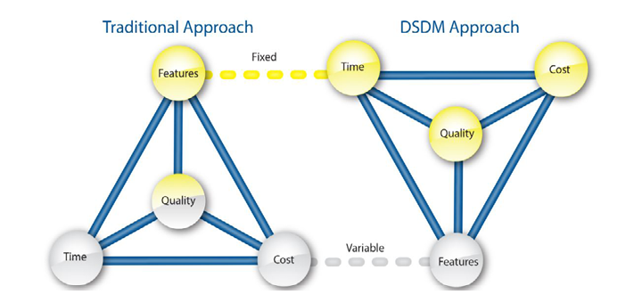

# Manifesto Ágil

O Manifesto Ágil surgiu em contramão aos métodos tradicionais, ou "pesados".  
17 profissionais da área que já praticavam os métodos "leves" se reuniram em Utah em 2001 para definir métodos e práticas para o desenvolvimento de software.  
Esses métodos já existiam e já estavam sendo utilizados, mas não havia documentação sobre de fato o que seriam os métodos ágeis.

### O que diz o Manifesto Ágil?

#### 4 Valores do Manifesto Ágil

- *Indivíduos e interações* mais que processos e ferramentas
- *Software em funcionamento* mais que documentação abrangente
- *Colaboração com o cliente* mais que negociação de contratos
- *Responder a mudanças* mais que seguir um plano

#### 12 princípios do Manifesto Ágil

1. Nossa maior prioridade é satisfazer o cliente através da entrega contínua e adiantada de software com valor agregado
2. Mudanças nos requisitos são bem-vindas, mesmo tardiamente no desenvolvimento. Processos ágeis tiram vantagem das mudanças visando vantagem competitiva para o cliente
3. Entregar frequentemente software funcionando, de poucas semanas a poucos meses, com preferência à menor escala de tempo
4. Pessoas de negócio e desenvolvedores devem trabalhar em conjunto diariamente por todo o projeto
5. Construa projetos em torno de indivíduos motivados. Dê a eles o ambiente e o suporte necessário e confie neles para fazer o trabalho
6. O método mais eficiente e eficaz de transmitir informações para e entre uma equipe de desenvolvimento é por meio de conversa face a face
7. Software funcionando é a medida primária de progresso
8. Os processos ágeis promovem desenvolvimento sustentável. Os patrocinadores, desenvolvedores e usuários devem ser capazes de manter um ritmo constante indefinidamente
9. Contínua atenção à excelência técnica e bom design aumenta a agilidade
10. Simplicidade – a arte de maximizar a quantidade de trabalho não realizado – é essencial
11. As melhores arquiteturas, requisitos e designs emergem de equipes auto-organizáveis
12. Em intervalos regulares, a equipe reflete sobre como se tornar mais eficaz e então refina e ajusta seu comportamento de acordo.

# Extreme Programming

Primeiros trabalhos e métodos associados foram usados em 1980. Trabalho originado por Kent Beck.

### O Processo do Extreme Programming

Foi criado sobre o paradigma de orientação a objetos.  
Ele envolve regras e práticas constantes durante o processo de software.  
O Extreme Programming é uma prática voltada para o desenvolvimento de software, diferentemente do Scrum que pode ser usado para outros tipos de projetos.

#### Planejamento

Foco na comunicação, em ouvir o cliente e planejar o desenvolvimento.  
Nessa etapa é feito o Planning Poker, para definir a complexidade das atividades.  
Essa atividade leva à criação de histórias de usuário e as prioriza.  
Os membros estimam o prazo de desenvolvimento em semanas. O máximo ideal é 3 semanas para desenvolver uma história.  
Há a flexibilidade para escrever novas histórias de usuário conforme necessário.  
Os cliente e desenvolvedores trabalham lado a lado, com a comunicação constante para direcionar o desenvolvimento.  
É definido um parâmetro de Velocidade, que é o número de histórias de usuário entregues em um período de tempo.

#### Projeto

Utiliza o Princípio KISS (Keep It Simple, Stupid!), que prega manter a simplicidade. Ele visa criar algo que seja suficiente, necessário, mas que funcione e atenda às necessidades.  
Utiliza os cartões CRC (Classe-Responsabilidade-Colaborador)  
As soluções são desenvolvidas a partir de protótipos, que podem ser até modelos não implementados, que possuem apenas o Front-End.

#### Codificação

O desenvolvimento é feito com base no TDD (Test Driven Development)  
Primeiro são criados os testes para os cenários desejados, que irão falhar na execução, pois não há código. Depois, é feito o código para passar nos testes desenvolvidos anteriormente. Por fim, é feita uma refatoração do código para melhorar a implementação.  
Também é utilizada a Programação em Pares, que consiste em duas pessoas sentarem juntas, uma programar, e a outra monitorar e dar ideias, para agilizar as reviews e as ideias.

#### Testes

Além do uso do TDD, a etapa de testes também é essencial!  
Nessa etapa, são feitos os testes de integração contínua e os testes de aceite baseados nas histórias do usuário.

### Valores do Extreme Programming

- Simplicidade | Coragem | Feedback | Respeito | Comunicação

# SCRUM

O nome provém de uma ação em uma partida de Rugby: Os jogadores dos dois times se juntam de cabeça abaixada e se empurram para obter a posse de bola.

O Scrum foi criado por Jeff Sutherland no início da década de 1990 e desde então vem sendo revisado.  
Ele é um framework leve que ajuda as pessoas, times e organizações a gerar valor por meio de soluções adaptativas para problemas complexos.  
Ele foi baseado no empirismo e lean thinking.  
Ele é iterativo e incremental, e possui eventos formais para inspeção e adaptação.

##### Pilares do Scrum

- Transparência | Adaptação | Inspeção

##### Valores do Scrum

- Coragem | Foco | Comprometimento | Respeito | Abertura

### Processo do Scrum

- O processo começa com a Ideia do Produto.
O Product Owner cria as histórias do usuário baseado na visão do cliente em relação ao produto, e suas necessidades. Então ele coloca a história do usuário na Product Backlog.
- Depois existe a reunião de Planning, onde a equipe se reúne e os desenvolvedores podem definir a meta da Sprint, o que eles conseguirão entregar no final desse período.
- Depois ocorre a Sprint, que é o processo de desenvolvimento de fato, que ocorre de duas a quatro semanas.
Ela também tem um evento diário chamado Daily, que é a reunião em que a equipe acompanha o andamento do projeto.

### Eventos

##### Sprint

Um evento de duração fixa com o objetivo de gerar um incremento. A meta da sprint é criar um novo incremento do produto, e dura de 2 a 4 semanas.  
As atividades da Sprint são:
- Planning | Daily | Review | Retrospective

Não se deve fazer mudanças que coloquem em risco a meta da Sprint. Deve haver sempre adaptação de acordo com as condições, mas cada Sprint tem uma meta que deve ser mantida como o seu foco.  
Somente o Product Owner pode cancelar a Sprint.

A Sprint é sempre focada na qualidade do produto, e pode ser feito o refinamento de requisitos conforme necessário.

##### Planning

A Planning é o evento que inicia a sprint. Ela define todo o trabalho que será realizado na sprint.  
Ela faz 3 perguntas:
- Por que a sprint é valiosa?
- O que pode ser feito nessa sprint?
- Como o trabalho será realizado?

Após a definição das metas e a resposta dessas perguntas, é então criado o Sprint Backlog, que define os trabalhos a serem realizados nela.

##### Daily

A Daily é uma reunião que ocorre todos os dias durante uma sprint.  
Essa reunião dura de 15 a 30 minutos, dependendo do tamanho da equipe.  
Ela tem como objetivo inspecionar a direção da meta da Sprint, e se o progresso está se aproximando dela.

##### Sprint Review

No final da Sprint, é feita uma revisão para inspecionar e apresentar os resultados.  
Ela determina as adaptações baseado no que foi feito ou não foi feito.  
Essa reunião é focada em mostrar para o cliente a entrega do incremento.

##### Sprint Retrospective

Essa reunião é focada com o time.  
Ela faz um planejamento baseado na qualidade e na eficácia, inspecionando os processos, iterações e ferramentas.  
Nela é discutido o que funcionou ou não funcionou durante a sprint, os problemas que foram enfrentados, como eles foram resolvidos.  
A Retrospective conclui a Sprint.

### Artefatos

Os artefatos são as documentações geradas por cada etapa.  
Os artefatos gerados são:
- Product Backlog - Meta do produto
- Sprint Backloh - Meta da spring
- Incremento - Definição de Pronto

### Scrum Team

O time de pessoas sem hierarquia relacionadas ao produto:
- Scrum Master | Product Owner | Developers

O time é multifuncional e autogerenciável, sendo responsáveis por todas as atividades relacionadas ao produto

##### Product Owner

A pessoa que maximiza o valor do produto. Ele ajuda a equipe a enxergar o valor daquele incremento que será desenvolvido  
Ele também gerencia o Product Backlog:
- Desenvolve e expressa a meta do produto
- Cria e comunica os itens do Backlog
- Ordena itens do Backlog
- Garante que o Product Backlog seja transparente, visível e compreensível

##### Desenvolvedores

Pessoas responsáveis por criar o incremento utilizável a cada sprint.  
Os desenvolvedores são todas as pessoas responsáveis por criar o produto, fazendo qualquer uma das atividades relacionadas ao produto. Essa função não se resume apenas aos responsáveis por escrever código.  
Eles possuem habilidades amplas de acordo com o domínio do trabalho.  
As responsabilidades principais são:
- Criação da Sprint Backlog
- Alinhar a definição de Pronto 
- Adaptar-se com direção à meta da Sprint
- Responsabilizar-se como profissionais

##### Scrum Master

O guardião do Scrum, que garante a eficácia da metodologia.  
Essa pessoa é uma figura de referência para a aplicação da metodologia.  
Essa pessoas possui as responsabilidades:
- Treinar membros para se autogerenciarem
- Concentra-se no time
- Remove impedimentos
- Mantém os eventos funcionando de forma correta
- Auxilia o PO com técnicas e melhorias no gerenciamento da Backlog

# Outros Métodos Ágeis

### Método de Desenvolvimento de Sistemas Dinâmicos (DSDM)

Foco na construção e manutenção de sistemas com restrições de prazos curtos, por meio de prototipação em ambiente controlado.  
Ela segue uma analogia com o Princípio de Pareto, dizendo que "80% de uma aplicação pode ser entregue em 20% do tempo que levaria para a aplicação completa".

Esse modelo é iterativo e incremental.  
Ele requisita somente o trabalho suficiente para cada incremento.  
Ele pode ser combinado com o Extreme Programming.  
Nas abordagens tradicionais, o ponto principal da entrega são as funcionalidades. No DSDM, o ponto principal é o tempo.

#### Princípios

- Focar na necessidade do negócio
- Entregar dentro do prazo
- Colaborar
- Nunca comprometer a qualidade
- Construir incrementalmente a partir de bases sólidas
- Desenvolver iterativamente
- Comunicar de forma contínua e clara
- Demonstrar controle

#### Fases

- Pré-projeto: Orçamento, contrato e projetos candidatos
- Ciclo de vida: Desenvolvimento do produto
	- Análise de viabilidade
	- Iteração de modelo funcional
	- Iteração de design e construção
	- Implementação
- Pós-projeto: Manutenção, melhorias e ajustes

Diferentemente das outras metodologias, o DSDM possui papéis bem definidos para cada membro da equipe.

### Processo Unificado Ágil

A filosofia desse método é manter sequencia o que é amplo, e deixar iterativo para o que é particular.

##### Atividades

- Modelagem
- Implementação
- Testes
- Entrega
- Configuração e Gerenciamento
- Gerenciamento de Ambiente

### Kanban

Kanban significa "Cartão" ou "Sinalização"  
Ele é uma metodologia para organização de tarefas, não apenas para desenvolvimento de software.  
Ele é uma metodologia simples e normalmente é aliada a outros frameworks de gerenciamento de projetos.

A base do Kanban é utilizar cartões que representam as tarefas, e colocá-los em quadros que indicam o estado da tarefa, que se resume em:
- Para fazer
- Em andamento
- Finalizado