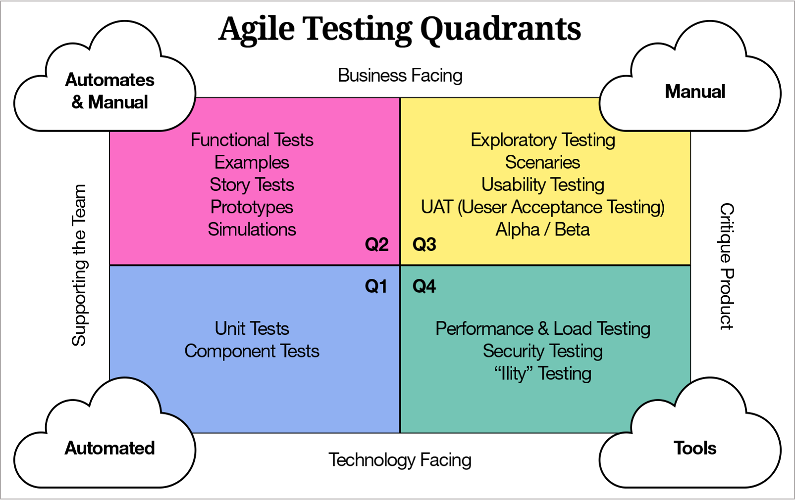

# Contextualizar a Atividade de Teste

Para cada atividade de desenvolvimento, existe uma atividade de teste. Há diferentes níveis e tipos de testes, presentes em todos os tipos de ciclo de vida. Há diferentes maneiras como os testes se encaixam no ciclo de vida, mas eles devem estar sempre presentes.  
A atividade de teste deve ser completa, desde o planejamento do projeto até o desenvolvimento do código.

#### História de Usuário - Conceito 3C

- **Cartão**: As histórias de usuário geralmente são escritas em cartões, que descrevem brevemente a história e as regras. Os cartões possuem um usuário, uma atividade que deve ser feita e um resultado esperado desta atividade.
- **Conversação**: Os detalhes da história do usuário são comunicados através de uma conversa com o cliente, que expressa as suas necessidades e resultados esperados neste requisito.
- **Confirmação**: Confirma que a história do usuário foi concluída corretamente através do teste de aceitação, utilizando os critérios de aceite, que são meios de confirmar que o comportamento da funcionalidade está sendo atendido com o desenvolvimento.

#### Atividades Envolvidas no Planejamento

- Fazer uma análise detalhada das histórias de usuário.
- Determinar a "testabilidade" da história: Fazer uma previsão de se ela pode ser testada ou não, e se pode ser testada automaticamente. Definir o quão fácil ou difícil seria a implementação dos testes.
- Criar os testes de aceite, que provêm diretamente da história do usuário.
- Criar as tarefas de teste.
- Estimar o esforço necessário para essas atividades.
- Identificar os aspectos funcionais e não funcionais que serão avaliados, definir qual o foco do teste para a funcionalidade, onde se deve preocupar mais com a funcionalidade e onde serão feitos mais testes.
- Participar do processo de automação, mesmo que não se esteja diretamente envolvido com os testes, é necessário garantir que os testes estão ocorrendo corretamente.

#### Detalhando a abordagem de teste

- Determinar o escopo do teste, a extensão que o teste terá no projeto, os objetivos que o teste deseja alcançar e os motivos para ser feito esse teste.
- Definir os membros que irão atuar com os testes, dependendo de sua capacidade técnica e o tipo de teste a ser feito.
- Definir os ambientes e os dados necessários, a estrutura que será utilizada para fazer o teste, se existem dados suficientes para o teste.
- Definindo o tempo do teste, as dependências necessárias e os pré-requisitos para o teste ser realizado.
- Definindo os riscos envolvidos no teste.

# Testes nas Abordagens Ágeis

### Diferenças na Abordagem de Testes Ágil

As atividades de testes estão sempre relacionadas com o desenvolvimento, portanto é importante conhecer os processos e ciclos de vida e como os testes se inserem neles. Customização e adaptação são importantes.

As atividades de qualidade estão embutidas em cada iteração, podendo ocorrer de forma paralela com outras atividades. A cada iteração, a atividade de testes começa assim que começa o Planejamento do projeto, com o planejamento dos testes, sua abordagem, cenários, casos de teste, dados utilizados. São atividades que devem ser feitas durante toda a iteração, em concorrência com os processos do desenvolvimento.

Nas abordagens ágeis, o foco dos testes é maior na questão de segurança, de performance e exploratórios. É preciso garantir que os sistemas atuam com segurança e que entregam uma boa performance. Os testes exploratórios são mais utilizados em entregas emergenciais, pois nem sempre é possível fazer uma documentação detalhada do software.

Também há um foco maior no uso de automação para testes de regressão, pois é importante ter um processo que lide rapidamente com estes testes no mundo ágil, onde há vários incrementos sendo entregues com rapidez. É preciso ter certeza de que os novos incrementos não afetam o que já estava funcionando anteriormente.

É necessário que se tenha uma documentação suficiente para poder garantir a qualidade e manutenção do software.

### Produtos de Trabalho Comuns

- Resultados de testes, manuais ou automatizados. Nas metodologias ágeis, esses resultados são mais rápidos para a visualização, sem muita burocracia ou muitos detalhes. É necessário ir direto ao ponto e mostrar qual o problema e quais os resultados.
- Planos de testes, que podem ter um escopo de tamanho variado dependendo do tempo disponível
- Análise de Risco, é necessário conversar com o Product Owner e os desenvolvedores para ver quais são os riscos para o sistema e o usuário. 
- Relatórios de defeitos, que fornecem informações sobre os defeitos relacionados a um plano de teste, incluindo sua descoberta e planos para correção.

### Níveis de Teste no Modelo Ágil

O nível de teste varia de acordo com o estágio do desenvolvimento.  
Cada teste é definido para validar uma funcionalidade ou parte específica do sistema, e estes testes devem ser feitos sobrepostos, para achar os problemas em partes diferentes do sistema.  
No modelo ágil, os testes com maior foco são os testes de unidade e os testes de aceite. Os testes de unidade conseguem pegar os problemas mais simples rapidamente, com um custo baixo e maior facilidade para corrigir o problema, e os testes de aceite garantem que o sistema está sendo desenvolvido conforme solicitado.

### Status de Testes no Modelo Ágil

Assim como ocorre nos projetos no modelo ágil, onde a transparência é passada diariamente para a equipe, o status dos testes também deve ser atualizado com frequência, para que a equipe esteja por dentro dos resultados, dos problemas, do que foi feito, de quais são os impedimentos e do que de fato foi concluído.  
Também é necessário monitorar o status de todas as atividades da equipe, o foco deve ser sempre no feedback da equipe, para garantir que a comunicação seja feita. Às vezes é necessário acompanhar de perto a equipe para conseguir evoluir os testes.

### Atitudes e Habilidade para Agilidade

- Positividade e pensamento na solução
- Pensamento crítico
- Foco em qualidade
- Comunicação constante com o cliente
- Feedbacks constantes
- Avaliação de cenários para critérios de aceite
- Colaboração em tempo integral
- Adaptação a mudanças
- Organização e planejamento

### Outras Atividades na Equipe Ágil

- Compreender e atualizar estratégias de teste
- Medir e informar a cobertura dos testes
- Garantir o uso adequado de ferramentas
- Gerenciar ambientes de teste
- Relatar defeitos
- Assegurar tarefas de forma adequada
- Esclarecimento contínuo de requisitos com a equipe
- Sugerir melhorias

# Métodos de Teste nos Modelos Ágeis

### TDD - Desenvolvimento Orientado por testes

Um método de desenvolvimento de software que se inicia pelos testes
1 - O desenvolvimento começa pela requisição escrita, os requisitos da funcionalidade
2 - É escrito um teste inicial, que vai ser executado e obrigatoriamente falhar, já que não existe código
3 - O código então é escrito para passar no teste, até que todos os testes passem com sucesso
4 - O código é então refatorado, processo pelo qual ele é limpo e são aplicadas as boas praticas da tecnologia
5 - É feita então uma nova iteração do TDD, com novos requisitos e novos testes

Esta forma de desenvolver é pensada para evitar vícios no desenvolvimento. Muitas vezes um desenvolvedor acaba focando e desenvolvendo o código com base na situação de sucesso, e acaba não olhando para as situações que podem dar problema. O TDD é feito para capturar essas situações de problema logo de início.

### ATDD - Desenvolvimento orientado a testes de aceite

Esta abordagem de testes é similar ao TDD. A diferença é que no TDD, os testes de unidade são focados e executados unicamente no código, pelos desenvolvedores, para validar o funcionamento técnico do software, enquanto que no ATDD, há a colaboração entre os desenvolvedores, os analistas de qualidade e os analistas de negócio, e tem como objetivo validar o software na visão de aceitação do cliente.

Este desenvolvimento ocorre em 4 fases:
- Inicialmente, há a fase de planejamento dos requisitos, onde são definidos cenários de utilização do software para entender como o usuário espera que ele se comporte. Assim podem ser criados os testes de aceitação com base nesses requisitos.
- Depois os testes são refinados e organizados no formato necessário para sua execução.
- O código é então implementado, com foco em fazer a funcionalidade passar no teste de aceitação. Normalmente, essa fase conta com o uso de TDD junto ao ATDD, para garantir que o código está de acordo com os testes unitários antes de passar para o teste de aceitação.
- Por fim, a história do usuário é verificada em uma nova reunião, onde o produto pode ser aprovado ou não. O resultado pode levar à criação de uma nova história ou alterações nos testes existentes.

### BDD - Desenvolvimento orientado a comportamento

O BDD é uma técnica de desenvolvimento de software que visa integrar as regras de negócio com a linguagem de programação. Ele possibilita que todos os membros do time utilizem uma mesma linguagem para realizar o trabalho, assim facilitando a comunicação entre as pessoas envolvidas na criação de um software.

### Quadrantes de testes ágeis

### Práticas úteis para testes

##### Teste assistido

Alguns tipos de testes são melhor realizados junto de uma outra pessoa, como o Product Owner ou o desenvolvedor, ou até mesmo com o cliente. Estes testes podem ser realizados para fazer uma verificação mais assertiva.

##### Teste incremental

É um teste que se inicia de forma simplificada, seja por haver dúvidas no escopo ou nos requisitos, e ao longo da sprint ele acaba sendo refinado, com melhorias sendo adicionadas conforme o teste vai sendo realizado.

##### Mapa mental

O mapa mental é um fluxograma feito a partir de uma ideia principal, neste caso um teste, para poder definir estratégias, cenários ou dados para construir o teste, fazer rascunhos e ter uma comunicação mais rápida.  
Pode ser feito em uma folha de papel ou em ferramentas específicas para isso.