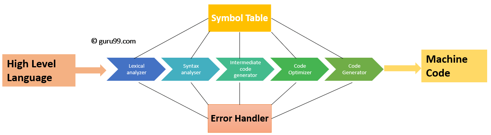

# Como Funciona o Compilador do .NET

O compilador é um conceito importante que é usado sempre que o código sofre alterações.

### Linguagem de Programação e de Máquina

- **Linguagem de Alto Nível**: A linguagem que humanos podem entender e utilizar para escrever o código fonte de um aplicativo.
- **Linguagem de Baixo Nível**: A linguagem que o computador entende, baseada em código binário (0s e 1s). Ela possui pouca abstração e é difícil de ser entendida por um ser humano.

O computador só entende linguagem binária. Mais especificamente, somente impulsos elétricos: ligado e desligado, representados pelos estados 1 e 0.
Porém, nós seres humanos normalmente não utilizamos a linguagem binária para programar. Nós escrevemos o código de forma que seja legível para nós, em uma linguagem de alto nível, e esse código precisa ser traduzido em uma linguagem de baixo nível para que o computador entenda e execute a aplicação.

### O que é um compilador?

O compilador é o programa responsável por fazer essa tradução. Ele converte o código de uma linguagem de alto nível para uma linguagem de baixo nível, pegando cada instrução e a processando até chegar em um código binário.
O compilador é um programa bem complexo, que passa por diversas fases até chegar no código de máquina.

### O Compilador do .NET

O compilador do .NET tem como objetivo pegar um código em C# (ou em outra linguagem de .NET) e transformá-lo em um código de máquina. Esse código C# é composto por uma ou mais classes.

Ao compilar o código, ele passa pelo processo de compilação, no C# Compiler, até chegar a um código de linguagem intermediário (ou código IL). Esse código IL é um código independente de máquina, que não depende de um computador ou arquitetura específicos pra executar. Esse código está contido em arquivos .exe e .dll.
O tempo que leva para ir do código em C# até o código IL é chamado de "Tempo de Compilação" (Compile time).

Após chegar no código IL, o programa está pronto para ser executado. Após executar o código, ele passa pelo JIT Compiler (Compilador Just in Time), que traduz os arquivos .exe e .dll para a arquitetura específica do computador que está sendo usado para executar, gerando o código nativo, ou seja, o código de máquina específico para esse computador. 
O tempo que leva para ir do código IL ao código nativo é chamado "Tempo de Execução" (Runtime).

### Compilador e Transpilador

O compilador é um tradutor que pega uma linguagem de alto nível e traduz para uma linguagem de baixo nível. As linguagens que utilizam o conceito de compilador para serem executadas são chamadas de "Linguagens compiladas".

Existe também o Transpilador.
O Transpilador é um programa que traduz uma linguagem de alto nível em uma outra linguagem de alto nível. Ele é usado para que duas linguagens se entendam e sejam compatíveis entre si. Um exemplo é o Typescript, que é transpilado para o Javascript.

#### Linguagens não Compiladas

As linguagens compiladas são as que o código fonte é traduzido para código de máquina.
Há também as linguagens interpretadas, que são as linguagens nas quais a leitura e a interpretação são feitas diretamente do código fonte. Exemplos: PHP e Javascript.